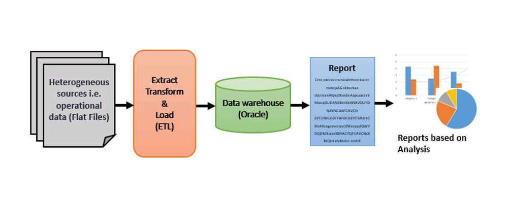

## 1. INTRODUCTION
This document outlines a case study. The case study is to develop IPL SEASON-WISE PERFORMANCE ANALYSIS.
This document contains the work flow of the system and gives guidelines on how to build the functionality gradually.

#### Setup check list for case study
Minimum System Requirements
•	Intel Pentium 90 or higher (P166 recommended)
•	Microsoft Windows 2010 or above.
•	Memory: 4GB of RAM (4GB or more recommended)
•	Internet Explorer 10.0 or higher
•	Oracle 11G / SQL server 2012 or higher 
•	Informatica 10.2.0/SSIS/Data Stage/ Abinitio
•	Tableau Desktop/SSRS/Power BI/ Qlikview

## 2.	PROBLEM STATEMENT

#### Objective

##### Development of IPL SEASON-WISE PERFORMANCE ANALYSIS to analyse following scenarios :-
•	Which team won the highest number of matches season-wise?
•	Percentage of winning matches after winning tosses?
•	Percentage of winning a match when batting first?
•	Top 3 stadium to host maximum number of matches in all seasons.
•	Top 3 teams to win by maximum margin of runs season-wise?
•	Umpires who umpired for maximum number of matches season-wise?
•	Season-wise comparison of toss-decisions made?
•	Win and Loss percentage of particular teams season-wise? (Any one team)

#### Abstract
Cricket is a religion in India and people of all faiths, caste creed and language remain glued to the TV or the radio to watch international level matches. The Indian Premier League - IPL is a ‘20-20’ version of Cricket where professional club teams from different cities play about 80 games with a final game deciding the champion. IPL has acquired a social dimension and it can act as an instrument of change for other Indian sports. 
The purpose of this project is to analyse the performance of each IPL season with respect to the different dimensions. It collects the data on various attributes like team performance, venues, seasons, winning and losing percentage, umpires in different seasons etc. There are 8 teams of IPL representing eight different cities in India. There have been twelve seasons of the IPL tournament. The current IPL title holders are the Mumbai Indians, who won the 2019 season. 

#### Technology Used:
•	Oracle 11G/ SQL server(Database)
•	Informatica power center / SSIS / Data Stage / Abinitio (ETL Tool) 
•	Tableau Desktop / SSRS / Power BI/ Qlikview / Microsoft Excel (Reporting Tool)

## 3. Project Flow

